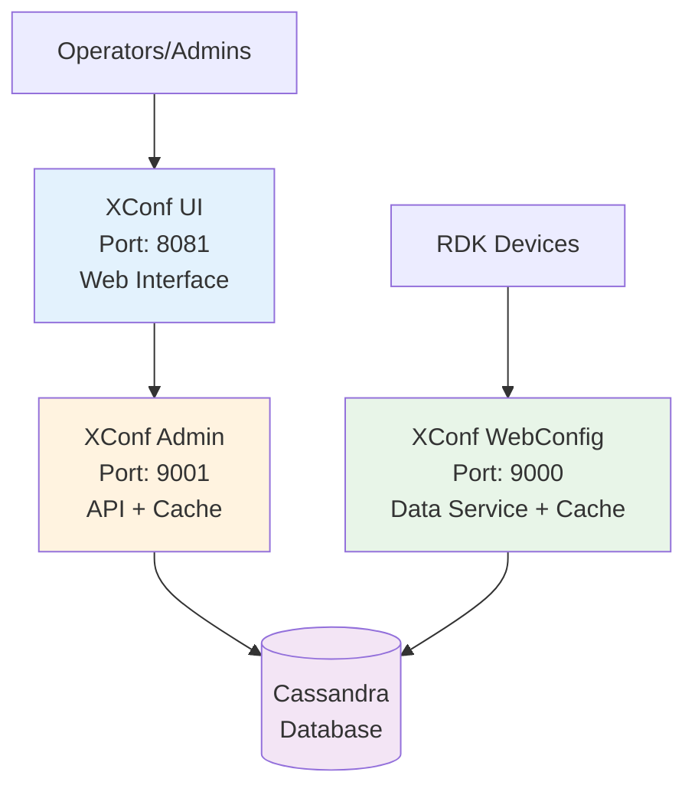
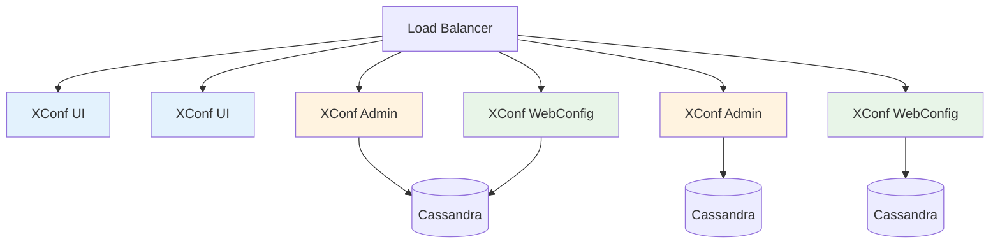
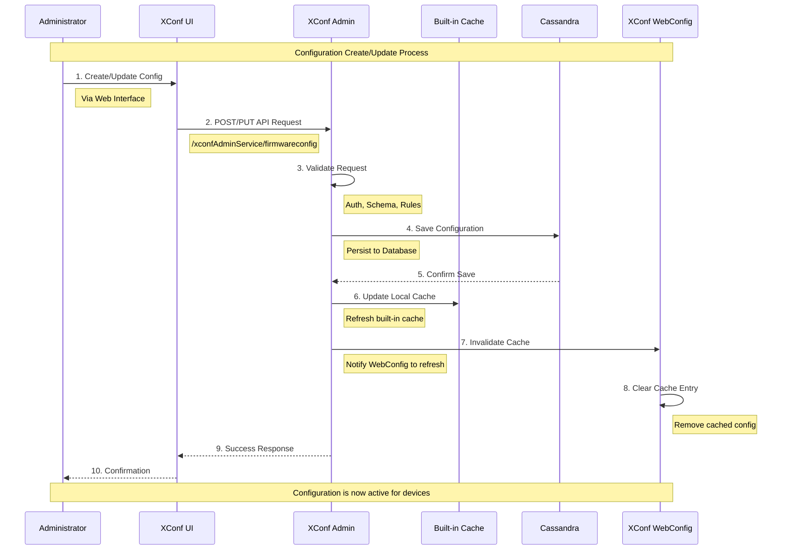
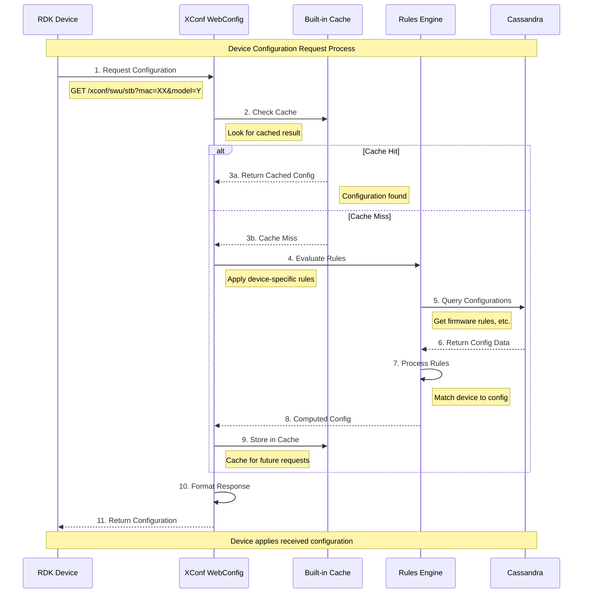
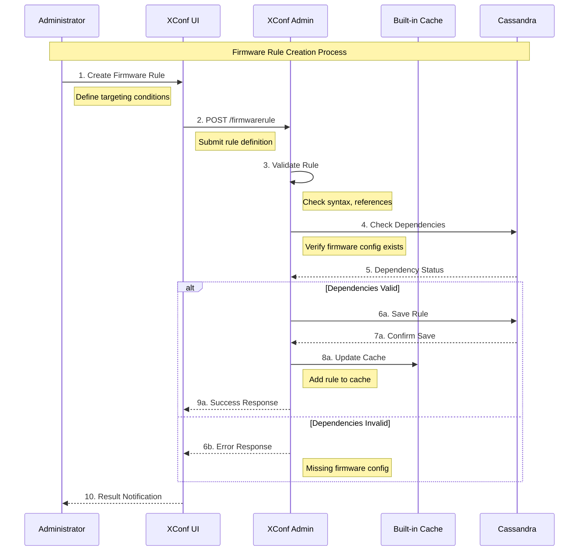
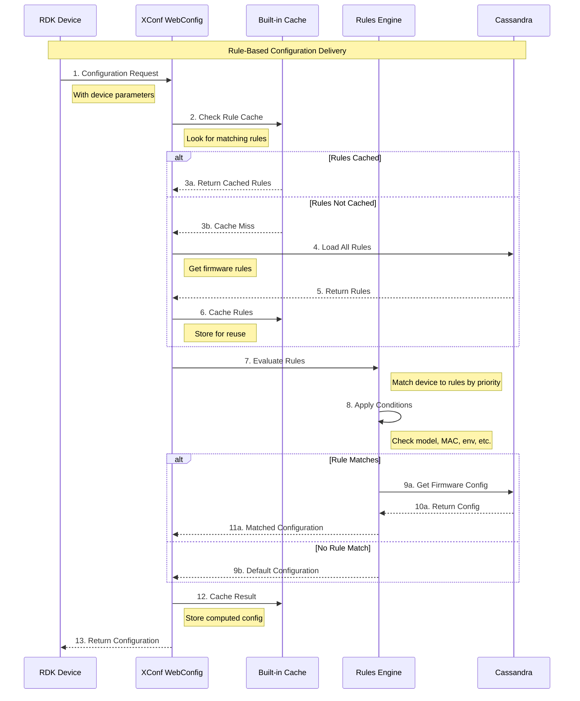
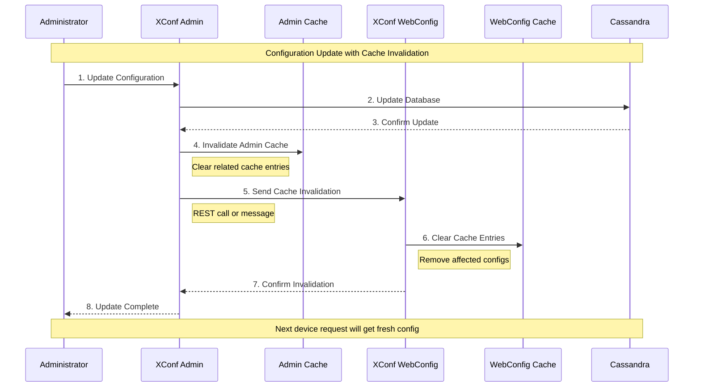

# XConf System Architecture

## System Architecture Diagram



## Deployment Architecture Diagram



## Process Flow Diagrams

### Admin Create/Update Configuration Flow



### Device Configuration Request Flow



### Admin Rule Creation Flow



### Device Rule Evaluation Flow



### Cache Invalidation Flow



## How to Generate PNG

To convert this Mermaid diagram to a PNG file, you can use several methods:

### Method 1: Mermaid CLI
```bash
# Install Mermaid CLI
npm install -g @mermaid-js/mermaid-cli

# Generate PNG from this markdown file
mmdc -i architecture.md -o architecture.png -t neutral -b white
```

### Method 2: Online Mermaid Live Editor
1. Visit: https://mermaid.live/
2. Copy the mermaid code from above
3. Paste into the editor
4. Download as PNG

### Method 3: VS Code Extension
1. Install "Mermaid Markdown Syntax Highlighting" extension
2. Open this file in VS Code
3. Right-click on the mermaid diagram
4. Select "Export Diagram" → PNG

### Method 4: GitHub Integration
GitHub automatically renders Mermaid diagrams in markdown files, and you can screenshot or use browser tools to save as PNG.

## Architecture Features

### Built-in Cache Integration
- **XConf Admin**: Contains its own built-in cache (Redis/In-Memory) integrated within the service
- **XConf WebConfig**: Has its own built-in cache layer for high-performance device requests
- **No Separate Cache Layer**: Eliminated the standalone cache infrastructure

### Enhanced Service Structure
- Each service shows internal components (API Handler, Cache, Business Logic)
- Cache operations are handled internally within each service
- Direct cache-to-database flow on cache misses

### Simplified Data Flow
- **WebConfig**: API → Built-in Cache → Rules Engine → Cassandra
- **Admin**: API → Built-in Cache → Business Logic → Cassandra
- **Cross-Service**: Admin can invalidate WebConfig cache on configuration updates

### Deployment Benefits
- **Reduced Infrastructure**: No need for separate Redis cluster management
- **Simplified Operations**: Cache management is part of service lifecycle
- **Better Performance**: In-process caching reduces network overhead
- **Cache Synchronization**: Services can sync cache state when needed