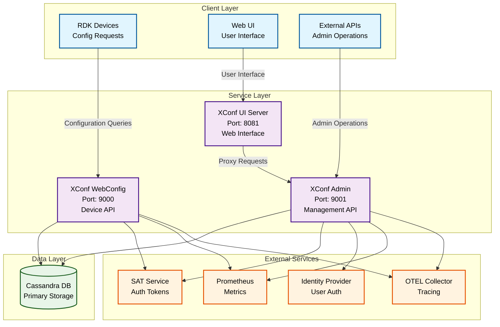
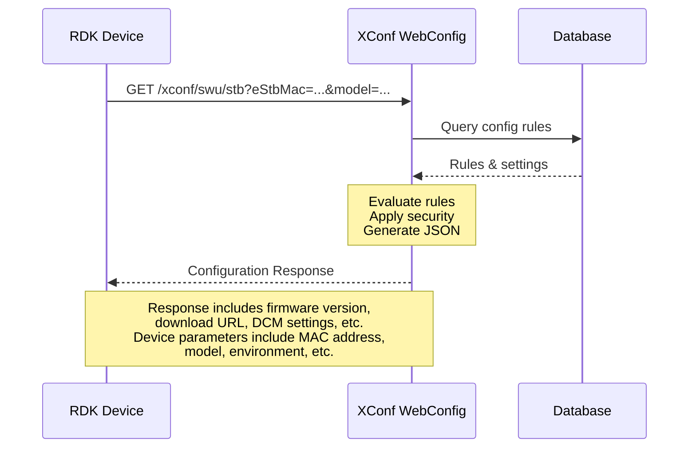
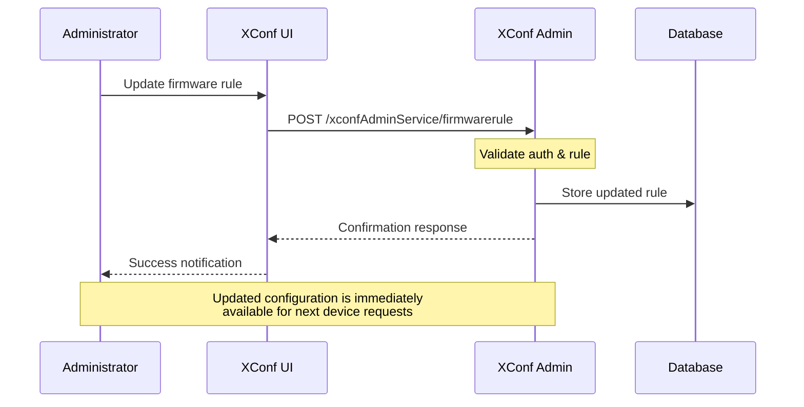
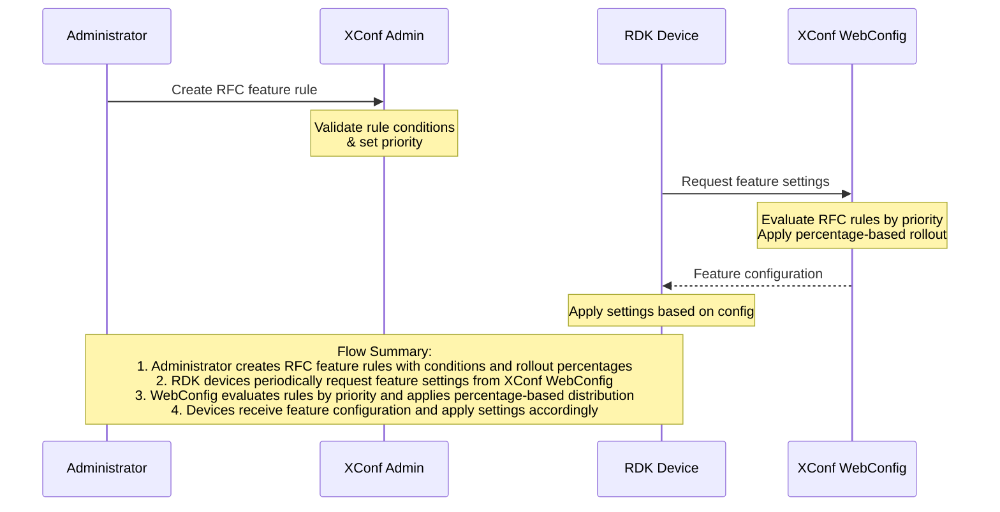
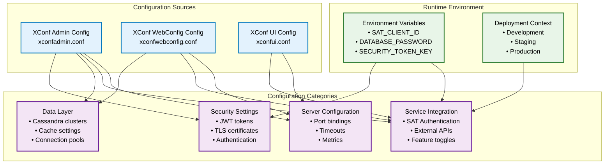
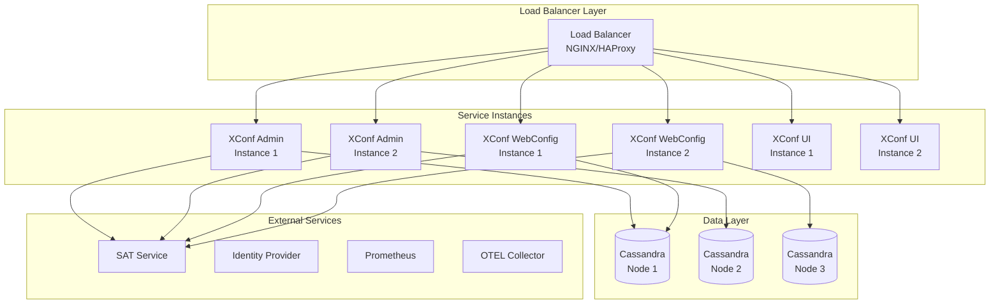

# XConf System Overview

## Table of Contents
- [Overview](#overview)
- [System Architecture](#system-architecture)
- [Core Components](#core-components)
- [Process Flow Diagrams](#process-flow-diagrams)
- [Use Cases](#use-cases)
- [API Overview](#api-overview)
- [Configuration Management](#configuration-management)
- [Deployment Architecture](#deployment-architecture)
- [Security Model](#security-model)
- [Getting Started](#getting-started)

## Overview

XConf is a comprehensive configuration management platform designed for RDK (Reference Design Kit) devices. It provides centralized control over device configurations, firmware updates, telemetry settings, and feature management across large-scale RDK deployments. The system is built with Go and follows a microservices architecture with three main components working together to deliver a complete configuration management solution.

### Key Features

- **Centralized Configuration Management**: XConf serves as a single point of control for all device configurations across large-scale RDK deployments. This unified approach eliminates configuration fragmentation and ensures consistency across thousands of devices in the field, providing operators with a comprehensive view of their entire device ecosystem.

- **Firmware Management**: The platform enables operators to control firmware distribution and updates with sophisticated canary deployment strategies. This includes percentage-based rollouts, device cohort targeting, and manual rollback procedures based on device analytics to minimize risk during firmware updates while ensuring rapid deployment of security patches and feature enhancements. Rollback procedures are not automatic and are always manual go/no-go decisions based on device analytics.

- **Telemetry Services**: XConf manages comprehensive telemetry profiles and data collection policies, allowing operators to configure what data is collected, how frequently it's gathered, and where it's uploaded. This enables data-driven insights into device performance and user behavior patterns while maintaining privacy compliance and optimizing bandwidth usage.

- **Device Control Manager (DCM)**: The DCM component handles critical device control settings and log upload policies, providing granular control over device behavior, log collection schedules, and diagnostic data management. This ensures proper device operation and facilitates troubleshooting when issues arise in production environments.

- **Feature Management (RFC)**: Through the RDK Feature Control system, operators can control feature flags and rules with priority-based evaluation, enabling safe feature rollouts and A/B testing scenarios. Features can be activated for specific device cohorts or gradually rolled out using percentage-based distribution with real-time monitoring and manual rollback capabilities based on device analytics.

- **Authentication and Authorization**: Robust security mechanisms provide JWT-based authentication with comprehensive role-based access control, ensuring that only authorized personnel can modify configurations. All changes are properly audited and tracked, maintaining complete operational transparency and compliance requirements.

- **RESTful APIs**: The system exposes comprehensive RESTful APIs for all operations, enabling programmatic access and integration with existing operational tools and workflows. This API-first approach supports automation and custom tooling development while maintaining consistent interface standards across all components.

- **Metrics and Monitoring**: Built-in observability capabilities include Prometheus metrics collection and OpenTelemetry distributed tracing support, providing complete visibility into system performance and operational health across all components. This enables proactive monitoring and rapid issue resolution.

- **High Availability**: The platform achieves operational resilience through distributed locking mechanisms and robust data persistence strategies that enable scalable operations across multiple data centers while maintaining data consistency and system reliability with optimized response times.

## System Architecture

The XConf system follows a three-tier architecture with clear separation of responsibilities:



### Architecture Principles
- **Microservices Design**: Each component has a specific responsibility
- **Stateless Services**: All services are stateless for horizontal scalability
- **Event-Driven**: Asynchronous processing for configuration changes
- **Security First**: Multiple layers of authentication and authorization
- **Observability**: Built-in metrics, logging, and distributed tracing

## Core Components

### 1. XConf Admin
**Purpose**: Administrative backend service for configuration management

**Key Capabilities**:
- Configuration CRUD operations (firmware, DCM, telemetry, RFC)
- Rule-based configuration management with priority handling
- User authentication and authorization
- Change management and audit logging
- API gateway for administrative functions

**Main Modules**:
- `adminapi/`: REST API handlers and routing
- `auth/`: Authentication and authorization services
- `firmware/`: Firmware configuration management
- `dcm/`: Device Control Manager settings
- `telemetry/`: Telemetry profile management
- `rfc/`: RDK Feature Control management
- `queries/`: Query and reporting services

### 2. XConf WebConfig
**Purpose**: Data service for RDK devices to retrieve configurations

**Key Capabilities**:
- High-performance configuration delivery to RDK devices
- Rule engine for dynamic configuration evaluation
- Firmware version determination and distribution control
- Telemetry and DCM settings delivery
- Health checks and diagnostics

**Main Modules**:
- `dataapi/`: Device-facing API endpoints
- `rulesengine/`: Configuration rule evaluation
- `db/`: Database abstraction and caching
- `security/`: Request validation and security
- `tracing/`: Distributed tracing implementation

### 3. XConf UI
**Purpose**: Web-based user interface for system administration

**Key Capabilities**:
- Interactive web interface for configuration management
- Proxy service to XConf Admin backend
- Static asset serving (HTML, CSS, JavaScript)
- User session management

**Main Modules**:
- `app/`: Angular-based web application
- `server/`: Go-based proxy server
- `templates/`: HTML templates

## Process Flow Diagrams

### Device Configuration Request Flow



### Administrative Configuration Update Flow



### Feature Flag Management Flow



## Use Cases

The XConf platform supports diverse operational scenarios across different organizational roles and responsibilities. Each use case demonstrates the platform's capability to address specific configuration management challenges in RDK device deployments.

### Use Case 1: Firmware Management
**Primary Actors**: Operations Team, DevOps Team  
**Supporting Systems**: XConf Admin, XConf WebConfig, Device Fleet

**Scenario**: Operations teams need to roll out new firmware versions to thousands of RDK devices while minimizing risk and ensuring system stability during the deployment process.

**Process Flow**:
1. **Upload Firmware Configuration**: Operations team uploads firmware version metadata including download URLs, checksums, and compatibility information through XConf Admin interface
2. **Create Deployment Rules**: Define targeting rules based on device models, environments, and partner configurations with conditional logic
3. **Configure Canary Strategy**: Implement percentage-based rollout starting with 1% of devices, gradually increasing to full deployment
4. **Monitor Deployment Progress**: Track firmware adoption rates, device health metrics, and rollback triggers through real-time dashboards
5. **Emergency Response**: Execute manual rollback procedures based on device analytics if issues are detected during deployment

**Expected Outcomes**: Controlled firmware distribution with minimized risk, comprehensive deployment visibility, and rapid issue resolution capabilities.

### Use Case 2: Device Control Manager (DCM) Configuration  
**Primary Actors**: Support Team, Operations Team  
**Supporting Systems**: XConf Admin, Device Diagnostic Systems

**Scenario**: Support teams require granular control over device log collection, diagnostic data uploads, and device behavior parameters to facilitate troubleshooting and maintain operational visibility.

**Process Flow**:
1. **Define Log Upload Policies**: Configure log collection schedules, retention policies, and upload destinations based on device types and support requirements
2. **Configure Device Settings**: Set device behavior parameters including reboot schedules, diagnostic intervals, and maintenance windows
3. **Create Conditional Formulas**: Implement rule-based logic for dynamic device control based on device health, network conditions, and operational requirements
4. **Deploy Settings**: Push DCM configurations to targeted device populations with validation and manual rollback capabilities based on device analytics
5. **Monitor Collection**: Track log upload success rates, diagnostic data quality, and device compliance with configured policies

**Expected Outcomes**: Automated log collection, improved troubleshooting capabilities, and enhanced device operational visibility.

### Use Case 3: Feature Flag Control (RFC)
**Primary Actors**: Product Team, QA Team  
**Supporting Systems**: XConf Admin, XConf WebConfig, Feature Management System

**Scenario**: Product teams need to implement safe feature rollouts, conduct A/B testing, and manage experimental features across device populations with precise targeting and manual rollback capabilities based on device analytics.

**Process Flow**:
1. **Create Feature Control Rules**: Define feature activation conditions based on device characteristics, user segments, and deployment criteria
2. **Configure Rollout Strategy**: Implement percentage-based feature distribution with gradual increase and statistical validation
3. **Set Feature Parameters**: Configure feature-specific settings, default values, and behavioral parameters for targeted device groups
4. **Monitor Feature Performance**: Track feature adoption rates, user engagement metrics, and system performance impact
5. **Optimize and Scale**: Adjust feature parameters based on performance data and scale successful features to broader device populations

**Expected Outcomes**: Safe feature experimentation, data-driven feature decisions, and controlled feature deployment with rapid iteration capabilities.

### Use Case 4: Telemetry Management
**Primary Actors**: Analytics Team, Product Team  
**Supporting Systems**: XConf Admin, Data Collection Infrastructure, Analytics Platform

**Scenario**: Analytics teams require comprehensive telemetry data collection from device populations to support product insights, performance optimization, and business intelligence initiatives.

**Process Flow**:
1. **Define Collection Profiles**: Configure telemetry metrics, collection intervals, and data schemas based on analytical requirements
2. **Target Device Segments**: Create targeting rules for different device populations, user segments, and geographical regions
3. **Configure Upload Schedules**: Set data upload frequencies, bandwidth optimization, and privacy compliance parameters
4. **Validate Data Quality**: Implement data validation rules, quality checks, and error handling procedures
5. **Generate Analytics Reports**: Process collected telemetry data for business insights, performance optimization, and product development

**Expected Outcomes**: Comprehensive device insights, data-driven product decisions, and optimized user experience based on telemetry analytics.

### Use Case 5: Environment Configuration Management
**Primary Actors**: DevOps Team, Infrastructure Team  
**Supporting Systems**: XConf Admin, CI/CD Pipeline, Environment Management Tools

**Scenario**: DevOps teams need to maintain configuration consistency across development, staging, and production environments while enabling seamless configuration promotion and environment-specific customizations.

**Process Flow**:
1. **Define Environment Rules**: Create environment-specific configuration rules with inheritance patterns and override capabilities
2. **Configure Version Management**: Implement configuration versioning with promotion workflows and manual rollback procedures based on device analytics
3. **Enforce Policy Compliance**: Set automated policy validation, compliance checks, and approval workflows for configuration changes
4. **Promote Configurations**: Execute seamless configuration promotion from development through staging to production environments
5. **Monitor Configuration Drift**: Track configuration differences across environments and implement drift detection and correction

**Expected Outcomes**: Consistent multi-environment configuration management, streamlined deployment workflows, and reduced configuration-related issues.

### Use Case 6: Real-time Device Configuration
**Primary Actors**: RDK Devices, Automated Systems  
**Supporting Systems**: XConf WebConfig, Device Management Platform, Network Infrastructure

**Scenario**: RDK devices automatically request and receive configuration updates, apply settings based on their characteristics, and report status back to the platform for monitoring and compliance verification.

**Process Flow**:
1. **Request Configurations**: Devices periodically query XConf WebConfig for current configuration updates based on device parameters
2. **Receive Targeted Settings**: Platform delivers device-specific configurations including firmware versions, feature settings, and operational parameters
3. **Apply Configuration Changes**: Devices validate and apply received configurations with appropriate error handling and manual rollback capabilities based on operator decisions
4. **Report Status Updates**: Devices provide feedback on configuration application success, system health, and operational status
5. **Maintain Compliance**: Continuous monitoring ensures devices maintain compliance with current configuration policies

**Expected Outcomes**: Automated device configuration management, real-time compliance monitoring, and seamless configuration distribution across device populations.

### Use Case 7: System Monitoring and Observability  
**Primary Actors**: Operations Team, Support Team, DevOps Team  
**Supporting Systems**: Prometheus, OTEL Collector, Monitoring Dashboards, Alert Management

**Scenario**: Cross-functional teams require comprehensive monitoring of system health, deployment progress, performance metrics, and operational status through integrated dashboards and proactive alerting mechanisms.

**Process Flow**:
1. **Configure Monitoring Infrastructure**: Set up comprehensive metrics collection, distributed tracing, and log aggregation across all system components
2. **Create Performance Dashboards**: Implement real-time dashboards showing system health, device connectivity, and configuration distribution metrics
3. **Define Alert Policies**: Configure intelligent alerting for system anomalies, performance degradation, and operational issues
4. **Track Deployment Progress**: Monitor configuration rollouts, feature adoption rates, and deployment success metrics
5. **Investigate and Resolve Issues**: Use integrated monitoring data for rapid issue identification, root cause analysis, and resolution tracking

**Expected Outcomes**: Proactive system monitoring, rapid issue detection and resolution, and comprehensive operational visibility across the entire XConf platform.

## API Overview

### XConf Admin API (`/xconfAdminService`)
**Authentication**: JWT tokens or session-based authentication
**Base URL**: `http://host:9001/xconfAdminService`

**Key Endpoints**:
- `GET/POST/PUT/DELETE /firmwareconfig` - Firmware configuration management
- `GET/POST/PUT/DELETE /firmwarerule` - Firmware rule management
- `GET/POST/PUT/DELETE /dcm/formula` - DCM formula management
- `GET/POST/PUT/DELETE /telemetry/profile` - Telemetry profile management
- `GET/POST/PUT/DELETE /rfc/feature` - Feature rule management
- `GET /queries/environments` - Environment queries
- `POST /auth/basic` - Basic authentication
- `GET /provider` - Authentication provider info

### XConf WebConfig API (`/xconf`)
**Authentication**: Device-based validation
**Base URL**: `http://host:9000/xconf`

**Key Endpoints**:
- `GET /swu/stb` - Firmware configuration for STB devices
- `GET /loguploader/getSettings` - Log upload settings
- `GET /rfc/feature/getSettings` - Feature settings
- `GET /telemetry/getTelemetryProfiles` - Telemetry profiles
- `GET /dcm/getSettings` - DCM settings

### Request/Response Examples

**Device Firmware Request**:
```bash
GET /xconf/swu/stb?eStbMac=AA:BB:CC:DD:EE:FF&model=MODEL_X&env=PROD
```

**Firmware Response**:
```json
{
  "firmwareVersion": "2.1.0",
  "firmwareDownloadURL": "https://firmware.example.com/firmware-2.1.0.bin",
  "firmwareFilename": "firmware-2.1.0.bin",
  "rebootImmediately": false,
  "forceHttp": false
}
```

## Configuration Management

XConf utilizes HOCON (Human-Optimized Config Object Notation) configuration files that provide comprehensive control over all system components. The platform supports three distinct configuration profiles optimized for different operational responsibilities.

### Configuration Architecture



### XConf Admin Configuration 

**Primary Responsibilities**: Administrative backend operations, user authentication, and configuration management workflows.

**Key Configuration Areas**:
- **Service Integration**: Comprehensive external service connections including SAT authentication, Identity Provider (IDP), device services, account management, and tagging systems
- **Canary Management**: Advanced deployment controls with timezone support, percentage-based rollouts, and partner-specific configurations
- **Authentication Framework**: JWT-based security with configurable token validation and role-based access control
- **Cache Strategy**: Multi-level caching with configurable refresh cycles, distributed locking mechanisms, and performance optimization
- **Database Operations**: Cassandra cluster management with SSL support, connection pooling, and query optimization settings
- **Tracing & Observability**: OpenTelemetry integration with configurable endpoints and distributed tracing capabilities

**Notable Features**:
- Supports 20+ external service integrations with individual timeout and retry configurations
- Configurable canary deployment windows with timezone awareness
- Advanced distributed locking for concurrent operations
- Comprehensive audit logging and security token management

### XConf WebConfig Configuration 

**Primary Responsibilities**: High-performance device-facing API operations and configuration delivery optimization.

**Key Configuration Areas**:
- **Performance Optimization**: Enhanced caching strategies with group service integration, cache expiration policies, and connection pooling
- **Device Integration**: Specialized device service connections with model-specific configurations and validation rules
- **Feature Toggles**: Granular control over RFC features, firmware penetration metrics, and experimental capabilities
- **Security Enhancements**: Device-specific authentication, token management for firmware delivery, and protocol-based security controls
- **Data Processing**: Advanced configuration preprocessing, IP address parsing, and network mask management
- **Metrics Collection**: Device interaction metrics, model-based request tracking, and performance monitoring

**Notable Features**:
- Device-optimized caching with 4-hour refresh cycles for group services
- Security token integration for firmware download protection
- Advanced IP address processing with IPv4/IPv6 network mask support
- RFC precooking capabilities for improved response times
- Model-specific feature enablement for targeted device populations

### XConf UI Configuration

**Primary Responsibilities**: Web-based administration interface and proxy service management.

**Key Configuration Areas**:
- **Proxy Architecture**: Streamlined configuration for backend service integration through XConf Admin API
- **Web Server Settings**: Port configuration, static asset management, and web root directory specification
- **Logging Framework**: Structured logging with file-based output and caller information tracking
- **Development Support**: Simplified configuration for development environments and debugging capabilities

**Notable Features**:
- Lightweight configuration focused on web interface requirements
- Automatic proxy routing to XConf Admin backend services
- Development-friendly logging with detailed caller information
- Minimal external dependencies for rapid deployment

### Configuration Management Framework

**Environment Variable Integration**: The platform leverages secure environment variable injection for sensitive configuration parameters including SAT_CLIENT_ID and SAT_CLIENT_SECRET for service-to-service authentication credentials, DATABASE_USER and DATABASE_PASSWORD for Cassandra database authentication, and SECURITY_TOKEN_KEY for JWT token signing and validation operations.

**Configuration Validation & Processing**: XConf implements comprehensive HOCON format validation with nested object support, automatic environment variable substitution with intelligent default fallbacks, proactive service dependency validation and health checking mechanisms, and real-time configuration drift detection with automated alerting capabilities to ensure operational consistency.

**Multi-Environment Deployment Patterns**: The system supports distinct deployment configurations optimized for different operational contexts. Development environments utilize local configuration profiles with disabled external services and enhanced debug logging for rapid development cycles. Staging environments implement production-like configurations with dedicated test service endpoints and comprehensive monitoring integration for pre-production validation. Production deployments feature full external service integration with performance-optimized settings and enterprise-grade security hardening measures.

**Advanced Rule Engine & Logic**: XConf's configuration engine supports sophisticated conditional configuration mechanisms using complex boolean expressions for environment-specific settings, priority-based evaluation systems with hierarchical configuration override capabilities, temporal controls enabling time-based configuration activation and automated feature scheduling, and percentage distribution algorithms providing gradual rollout capabilities with statistical distribution controls for safe deployment practices.

**Comprehensive Configuration Scope**: The platform manages diverse configuration types including firmware management systems for version control and deployment strategies, DCM policies governing log collection schedules and device behavior parameters, RFC features enabling feature flag management and A/B testing configurations, telemetry profiles defining data collection policies and analytics configurations, and security policies establishing authentication requirements and access control matrices across all system components.

## Deployment Architecture

XConf's production deployment architecture follows enterprise-grade patterns with multiple layers of redundancy, horizontal scaling capabilities, and comprehensive observability integration. The platform is designed to handle high-throughput device communication while maintaining configuration consistency and operational reliability across distributed environments.

### Recommended Deployment Pattern



The deployment architecture implements a layered approach where the load balancer efficiently distributes incoming traffic across multiple service instances based on request type and current system load. Each service type operates multiple instances to ensure high availability and fault tolerance, with automatic failover mechanisms protecting against individual service failures. The Cassandra cluster provides distributed data storage with automatic replication and sharding capabilities, ensuring data consistency and availability even during node failures. External services integration encompasses authentication systems for secure access control, comprehensive monitoring infrastructure for operational visibility, and distributed tracing capabilities for performance optimization and troubleshooting support.

### Infrastructure Requirements
- **Compute**: Minimum 2 CPU cores, 4GB RAM per service instance
- **Storage**: SSD storage for database with replication
- **Network**: High-bandwidth connection for firmware distribution
- **Database**: Cassandra cluster with minimum 3 nodes for HA

### Scaling Considerations
- **Horizontal Scaling**: Stateless services support easy horizontal scaling
- **Database Sharding**: Cassandra provides automatic sharding and replication
- **Load Distribution**: Geographic distribution for global deployments

## Security Model

### Authentication Layers
1. **Service-to-Service**: SAT (Security Access Token) based authentication
2. **User Authentication**: Integration with enterprise identity providers
3. **Device Authentication**: MAC address and certificate-based validation
4. **API Security**: JWT tokens with role-based access control

### Authorization Framework
- **Entity-Based Permissions**: Granular permissions per configuration entity
- **Role-Based Access Control**: Predefined roles with specific capabilities
- **Operation-Level Security**: Read/write permissions per API endpoint
- **Environment Isolation**: Strict separation between environments

### Security Features
- **Token Validation**: Comprehensive JWT token validation and refresh
- **Request Sanitization**: Input validation and sanitization
- **Audit Logging**: Complete audit trail for all configuration changes
- **Secure Communication**: HTTPS/TLS for all service communications

## Getting Started

### Prerequisites
- **Go 1.23+**: For building and running the services
- **Cassandra 3.11+**: For data persistence
- **Node.js 24.1.0+**: For UI development
- **Git**: For source code management

### Quick Start

1. **Clone Repositories**:
```bash
git clone https://github.com/rdkcentral/xconfadmin.git
git clone https://github.com/rdkcentral/xconfui.git
git clone https://github.com/rdkcentral/xconfwebconfig.git
```

2. **Start Database**:
```bash
# Start Cassandra and create schema
cassandra -f &
cqlsh -f xconfwebconfig-main/db/db_init.cql
```

3. **Configure Services**:
```bash
# Copy and modify configuration files
cp xconfadmin/config/sample_xconfadmin.conf /etc/xconf/xconfadmin.conf
cp xconfwebconfig-main/config/sample_xconfwebconfig.conf /etc/xconf/xconfwebconfig.conf
cp xconfui-main/config/sample_xconfui.conf /etc/xconf/xconfui.conf
```

4. **Build and Run Services**:
```bash
# Build XConf Admin
cd xconfadmin && make build
./bin/xconfadmin-linux-amd64 -f /etc/xconf/xconfadmin.conf &

# Build XConf WebConfig
cd xconfwebconfig-main && make build
./bin/xconfwebconfig-linux-amd64 -f /etc/xconf/xconfwebconfig.conf &

# Build and Run XConf UI
cd xconfui-main
npm install && grunt install
go run *.go -f /etc/xconf/xconfui.conf &
```

5. **Access the System**:
- **Admin UI**: http://localhost:8081
- **Admin API**: http://localhost:9001/xconfAdminService
- **WebConfig API**: http://localhost:9000/xconf

### Configuration Tips
- Set environment variables for SAT_CLIENT_ID, SAT_CLIENT_SECRET, and SECURITY_TOKEN_KEY
- Configure appropriate log levels for production deployments
- Enable metrics and tracing for production monitoring
- Use environment-specific configuration files
- Implement proper backup strategies for Cassandra

### Development Workflow
1. Make changes to source code
2. Run unit tests: `go test ./...`
3. Build and test locally
4. Deploy to staging environment
5. Run integration tests
6. Deploy to production with canary rollout


This overview provides a comprehensive understanding of the XConf system architecture, components, and operational patterns. For detailed API documentation, refer to the individual API documentation files in each component directory.
